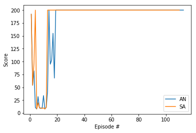

# Deep Reinforcement learning Learning blog 11 - Policy Based and Policy Gradient Method

This blog mainly  referenced:

- [Udacity DRLND course](https://www.udacity.com/course/deep-reinforcement-learning-nanodegree--nd893)

- ['SuttonBartoIPRLBook2ndEd'](https://web.stanford.edu/class/psych209/Readings/SuttonBartoIPRLBook2ndEd.pdf)

- [Andrej Karpathy blog](karpathy.github.io/2016/05/31/rl/)


## Intro

In the previous blogs, we have discussed the value-based method, it has been proved to perform well in certain mission. However, value-based methods also has many disadvantages, and policy-based method may come for rescue.

In the reinforcement learning, the ultimate goal of the agent is to learn the optimum policy for certain mission.

As for **value-based methods**, we firstly need to find an estimate of the **Optimal Value Function $q_*$**. In practice, this value function is usually in tabular form which the states are rows and actions are columns. The agent will decide the action in states based on the optimal value in this table.

Obviously, this tabular approach will fail if we have much larger state spaces, that's where a better function approximator, such as neural network comes in. And this has been shown a lot in our previous blogs.


However, in both the approaches, we need to firstly estimate the value function then to have the optimal policy. Also, the policy based on the value function is deterministic and sometimes we want a stochastic policy. If we would like the directly estimate the optimal policy, that is where the **Policy-Based Methods** comes in.

## Policy Function Approximation

With the example of the carpole, we can use the neural network with the states such as 'Cart Position','Cart Velocity', 'Pole Angle' and 'Pole Velocity at Tip' as the input nodes, and the probability of each action as output. And the goal is to maximize the expected return.  The number of the output nodes depends on number of the actions. Since  now  our outputs are probabilities  of each  action, the activation  function could be softmax.


For the continous action space, it is different, the neural network could have one node for each action index, and a activation function to output the continous value. As shown in the example of [BipedalWalker](https://github.com/openai/gym/wiki/BipedalWalker-v2), it has 4 action entries, each has the number between -1 and 1, we can add tanh activation function to the output layer.

Many details  of the activation function could  be referenced [here](https://pytorch.org/docs/stable/nn.html#torch.nn.Tanh).
## Hill Climbing
The agent's goal is to maximize expected return $J$. And the parameters of the approximator (NN) is $\theta$. $\theta$ encodes the policy, the policy influencesthe reward, and we sum up the rewards to get the return. If  we write the expected  return with the parameter $\theta$:
$$
J(\theta)=\sum_{\tau}P(\tau;\theta)R(\tau)
$$

In order to obtain the maximization of $J$, we can apply Gradient Ascent, which is similar to [gradient descent](https://en.wikipedia.org/wiki/Gradient_descent).

- Gradient descent steps in the direction opposite the gradient, since it wants to minimize a Function.

- Gradient Ascent is otherwise identical, except we step in the direction of the gradient, to reach the maximum.

The [Hill Climbing](https://en.wikipedia.org/wiki/Hill_climbing) is not exactly equal to Gradient ascent/descent, and it is not just for reinforcement learning.
Hill climbing will adjust a single element in
$x$ and determine whether the change improves the value of function. GA or GD will adjust all of  the values  in $x$ at each iteration accoding to the gradient of the hill.

**Pseudocode**

Initialize the weights $\theta$ in the policy arbitrarily.

Collect an episode with $\theta$, and record the return $G$.

$\theta_{best}\leftarrow\theta$, $G_{\theta}\leftarrow G$

Repeat until environment solved:

- Add a little bit of random noise to $\theta_{best}$, to get a new set of weights $\theta_{new}$
- Collect an episodewith $\theta_{new}$, and record the return $G_{new}$.

- If  $G_{new}>G_{best}$,then:
$\theta_{best}\leftarrow\theta_{new}$, $G_{\theta}\leftarrow G_{new}$

*Notice that the $G$ here is the return calculated in one  epsiode. $J$ is the expected return  in all episode. Generally, $G$ is not a good estimation of $J$, but it turns out to work in practice.*

## Improvements for Hill climbing (Black-box optimization techiques)
 Quoting from the Udacity course:

 *Black-box refers to the fact that in order to find the value of
$\theta$ that maximizes the function
$J = J(\theta)$, we need only be able to estimate the value of
$J$ at any potential value of $\theta$.*

*That is, both hill climbing and steepest ascent hill climbing don't know that we're solving a reinforcement learning problem, and they do not care that the function we're trying to maximize corresponds to the expected return.*

*These algorithms only know that for each value of
$\theta$, there's a corresponding number. We know that this number corresponds to the return obtained by using the policy corresponding to
$\theta$ to collect an episode, but the algorithms are not aware of this. To the algorithms, the way we evaluate
$\theta$ is considered a black box, and they don't worry about the details. The algorithms only care about finding the value of
$\theta$ that will maximize the number that comes out of the black box.*


**stochastic policy search**

We start from some arbitrary policy $\pi$ and defined by its parameters $\theta$, and evaluate it by applying that policy in the environment. During the evaluation, we add some small *Gaussian noise* to the parameters
to change the objective value.

If the new value is better than the best value that we have so far, we can set this policy  to be our new best policy and iterate.  In this case, we can  use any  policy  function, they do not need to be differentiable or even continous. But since we are taking random steps, this may not result in the most efficient path to the hill.

**Steepest Ascent**


Choose a small number of neighboring polices  at each iteration and pick the best among them. Comparing to fully stochastic search, it avoid the risk of selecting a next policy that may lead to a suboptimal solution. But we could still stuck in local optimal. To solve this, we can use random restarts or simulated annealing.


**Simulated Annealing**


It uses a pre-defined schedule to control how the policy space is explored. The search starts  with a large neighborhood to explore,  and we  gradually reduce the noise or radius as we get closer and closer to the Optimal solution.

*The name comes from the process of annealing an iron, when the iron gradually cools down to form the best particular structure arrangement resulting in a  hardened metal.*

**Adaptive Noise**


At the beginning, adaptive noise is  just like the Simulated Annealing, we reduce the random search radius (reducing or decaying the variance of the Gaussian noise we add) for generating the next policy. However, when we do not find the best policy,  we will increase the search radius, and continue exploring from  the current best policy. This tweak makes much less likely to get stuck.

**Cross-Entropy Method**


Cross-Entropy method chooses 10-20% points of the paremters that have the largest value. Instead of only one in the Steepest ascent.

[**Evolution Strategies**](https://openai.com/blog/evolution-strategies/)

Evolution strategies make use of all the stochastic search points and assume that the best policy will be a weighted sum  of all of these.

## Code implementations
A simple comparison between  the Adaptive Noise and Stimulate Annealing is implemented with the cartpole environment of gym.

Here, they both show similar performance, They both completed the Learning task in around 10 episodes. The Stimulate Annealing needs much smaller noise scale than the Adaptive Noise.

The implementation here referenced the Udacity codes.
```python
# Adaptive Noise
def hill_climbing_AN(n_episodes=1000, max_t=1000, gamma=1.0, print_every=100, noise_scale=1e-2):
    """Implementation of hill climbing with adaptive noise scaling.

    Params
    ======
        n_episodes (int): maximum number of training episodes
        max_t (int): maximum number of timesteps per episode
        gamma (float): discount rate
        print_every (int): how often to print average score (over last 100 episodes)
        noise_scale (float): standard deviation of additive noise
    """
    scores_deque = deque(maxlen=100)
    scores = []
    best_R = -np.Inf
    best_w = policy.w
    for i_episode in range(1, n_episodes+1):
        rewards = []
        state = env.reset()
        for t in range(max_t):
            action = policy.act(state)
            state, reward, done, _ = env.step(action)
            rewards.append(reward)
            if done:
                break
        scores_deque.append(sum(rewards))
        scores.append(sum(rewards))

        discounts = [gamma**i for i in range(len(rewards)+1)]
        R = sum([a*b for a,b in zip(discounts, rewards)])

        if R >= best_R: # found better weights
            best_R = R
            best_w = policy.w
            noise_scale = max(1e-3, noise_scale / 2)
            policy.w += noise_scale * np.random.rand(*policy.w.shape)
        else: # did not find better weights
            noise_scale = min(2, noise_scale * 2)
            policy.w = best_w + noise_scale * np.random.rand(*policy.w.shape)

        if i_episode % print_every == 0:
            print('Episode {}\tAverage Score: {:.2f}'.format(i_episode, np.mean(scores_deque)))
        if np.mean(scores_deque)>=195.0:
            print('Environment solved in {:d} episodes!\tAverage Score: {:.2f}'.format(i_episode-100, np.mean(scores_deque)))
            policy.w = best_w
            break

    return scores
```

```python
# Stimulate annealing
def hill_climbing_SA(n_episodes=1000, max_t=1000, gamma=1.0, print_every=100, noise_scale=1e-2):
    """Implementation of hill climbing with adaptive noise scaling.

    Params
    ======
        n_episodes (int): maximum number of training episodes
        max_t (int): maximum number of timesteps per episode
        gamma (float): discount rate
        print_every (int): how often to print average score (over last 100 episodes)
        noise_scale (float): standard deviation of additive noise
    """
    scores_deque = deque(maxlen=100)
    scores = []
    best_R = -np.Inf
    best_w = policy.w
    for i_episode in range(1, n_episodes+1):
        rewards = []
        state = env.reset()
        for t in range(max_t):
            action = policy.act(state)
            state, reward, done, _ = env.step(action)
            rewards.append(reward)
            if done:
                break
        scores_deque.append(sum(rewards))
        scores.append(sum(rewards))

        discounts = [gamma**i for i in range(len(rewards)+1)]
        R = sum([a*b for a,b in zip(discounts, rewards)])

        if R >= best_R: # found better weights
            best_R = R
            best_w = policy.w
            # for SA, the minimum noise_scale should be small enough
            noise_scale = max(1e-4, noise_scale / 2)
            policy.w += noise_scale * np.random.rand(*policy.w.shape)
        else:
            policy.w = best_w + noise_scale * np.random.rand(*policy.w.shape)

        if i_episode % print_every == 0:
            print('Episode {}\tAverage Score: {:.2f}'.format(i_episode, np.mean(scores_deque)))
        if np.mean(scores_deque)>=195.0:
            print('Environment solved in {:d} episodes!\tAverage Score: {:.2f}'.format(i_episode-100, np.mean(scores_deque)))
            policy.w = best_w
            break

    return scores
```
The output of the scores are shown in below.


However, by actually watching the agent behave, we can notice some small differences. The SA trained agent likes slowly drifting to one side and the AN trained agent seems more robust and stays still.

It seems the SA method is located in a sub-optimum solution. 
