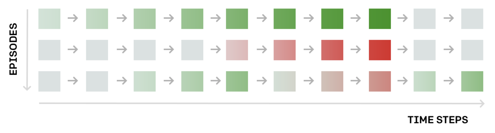

# Deep Reinforcement learning Learning blog 12 - Policy Gradient Method

This blog mainly referenced the Udacity DRLND course.

## Intro

In the previous blog, we have summarized several policy method in Reinforcement learning. These algorithms directly search  for the optimal object function value with random search in the parameter space and without knowing the gradients or minding the value function.

In this blog, we discuss  a subclass of policy-based methods, the policy gradient methods. Policy gradient methods estimate the policy function weights of optimal policy by gradient ascent.

##  The big picture

During training, the policy gradient method will iteratively amending 
