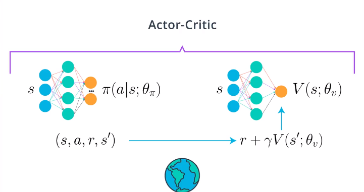
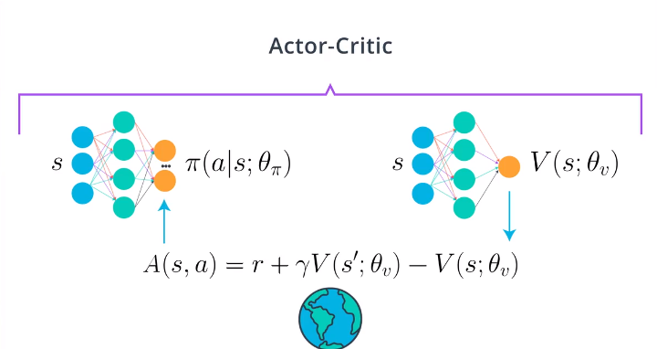
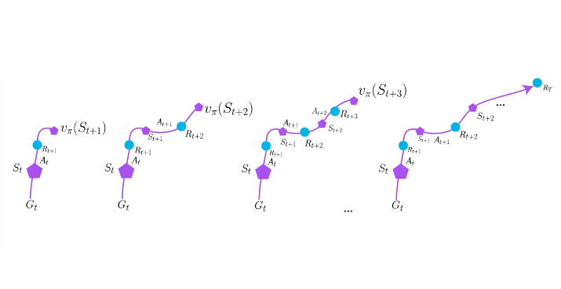
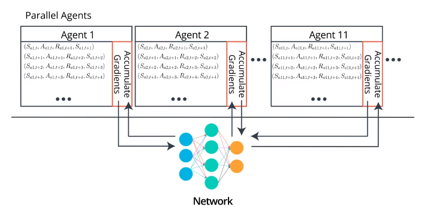
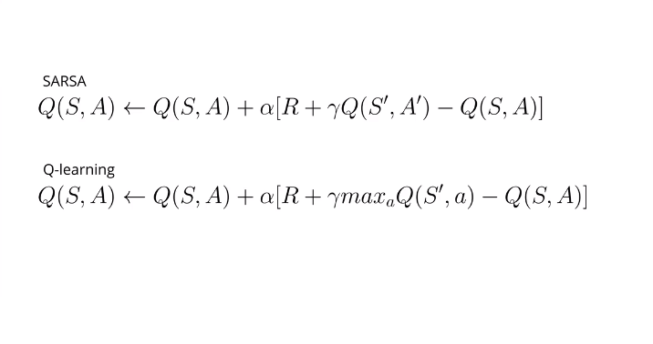
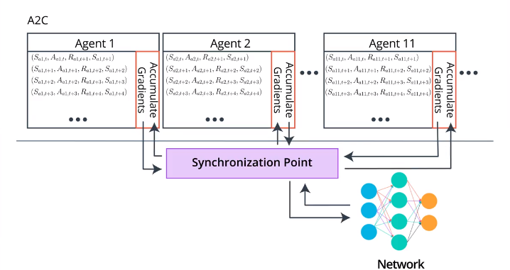
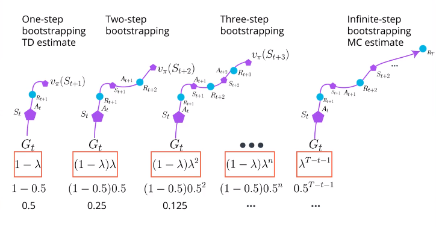
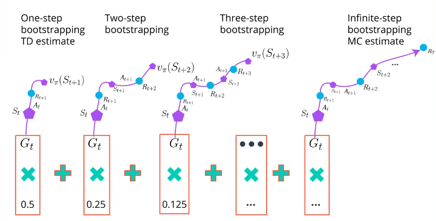
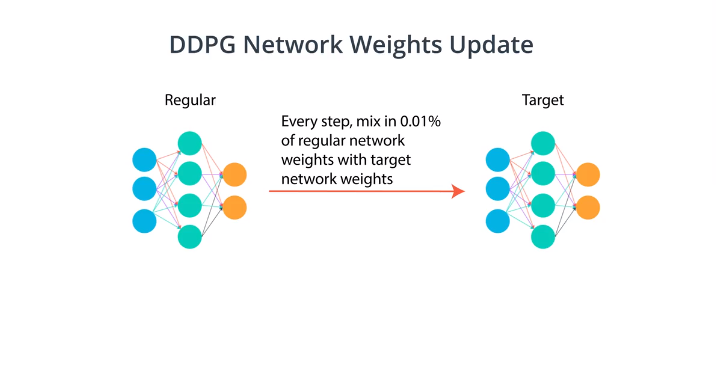

# Deep Reinforcement learning Learning blog 14 - Actor-critic
## Intro

Actor critic method is a combination of policy based method and value based method. The idea is to train simutaneously a value function as a base-line of the rewards, in order to reduce the variance of policy-based method.

## Estimating expected return

What are the ways of estimating expected return for actor-critic method?

### Monte Carlo estimate
Monte Carlo estimate consists of rolling out an episode in calculating the discount total reward from the rewards sequence.

$$
G_t=R_{t+1}+R_{t+2}+R_{t+3}+\cdots +R_T \\
G_t=R_{t+1}+\gamma R_{t+2}+\gamma^2 R_{t+3}+\cdots=\sum^{\infty}_{k=0}\gamma^{k}R_{t+k+1}
$$
The expected return is the average of rolled out episodes

$$
v_{\pi}(s)=E_{\pi}[G_t|S_t=s]=\frac{G_{t,A}+G_{t,B}+G_{t,C}}{3}
$$

### Temporal Difference (TD) estimate

In TD method, we estimate with an estimate. The estimate of $G_{t+1}$ could be off early on, but will become better and better as your agent sees more data.
$$
G_t=R_{t+1}+\gamma R_{t+2}+\gamma^2 R_{t+3}+ \gamma^3 R_{t+4} \cdots \\
=R_{t+1}+\gamma (R_{t+2}+\gamma R_{t+3}+ \gamma^2 R_{t+4} \cdots) \\
=R_{t+1}+\gamma G_{t+1}
$$

$$
v_{\pi}(s)=E_{\pi}[G_t|S_t=s]  \\
= E_{\pi}[R_{t+1}+\gamma G_{t+1}|S_t=s] \\
= E_{\pi}[R_{t+1}+\gamma v_{\pi}(S_{t+1})|S_t=s]  
$$

$$
V(S_t)=V(S_t)+\alpha[R_{t+1}+\gamma V(S_{t+1})-V(S_t)]
$$

### differences
- Monte Carlo Methods has large variance since the differences between all the episodes could be huge. But Monte Carlo methods are unbiased, since you are not estimate with estimates, you are only using the true rewards you obtains

- TD methods are low variances since you are only compounding a single randomness instead of a full rollout. However, since you are bootstrapping on the next state estimates, and those are not true values. This adding bias to your calculation. The agent will learn faster, but will have more problems converging.

## Basic actor-critic agent
An actor-critic agent is an agent that uses function approximation to learn a policy, and a value function.

- critic: a function estimator such as neural network to evaluate the state value function $v_{\pi}$ using TD estimate. Critic will calculate the advantage function and train the actor using this value.

- actor: the function estimator such as neural network that evaluate the policy.

## A3C: Asynchronous Advantage Actor-Critic, N-step bootstrapping

- The original A3C use 1 set of CNN network and 2 output nodes to learn policy and value function with shared weights.

- Note that the A3C algorthm is not limited to CNN nor shared weights, it could be more stable and easier to train by starting with 2 seperate networks and then try out shared weights.

- A3C use N-step bootstrapping to train the critic. The N-step bootstrapping is an expansion of TD methods. The traditional TD method do bootstrapping immediately within one step. N-step bootstrapping means using estimation n-step later in one episode.

Using more true rewards, furtherly reduce the bias and keep the variance under control.

- No replay buffer, replaced by parallel training. Running all these agents all in the same time. The agent will recieve mini batches of the correlated experiences just as we needed. Samples will be decorrelated because agents will likely be experiencing different states at any given time. On top of that, this allows us to use on-policy learning in our learning algorithm, which is often associated with more stable learning.

- On-policy and off-policy learning.
  1. **On-policy**: policy used for interacting with the environment is also the policy being learned. (e.g. SARSA, A3C, which try to learn best explory policy)

  In on-policy learning, you only use the data generated by the policy currently being learned about. When you have improved the policy, you toss out the old data and go collect some more. It is a bit **inefficient in sampling** but often has **more stable and consistent convergence properties**.

  2. **Off-policy**: policy used for interacting with the environment is different than the policy being learned. (e.g. Q-learning, DQN, which try to learn optimum policy with $\epsilon$-greedy exploration)

  Off policy method could let agent to learn from all source of different policies, but is known to be **unstable and often diverge** with deep neural networks.
  

Combination of On and Off policy learning: [Q-Prop paper](https://arxiv.org/abs/1611.02247)

- asynchronization means each parallel agent update the network on its own.

## A2C: Advantage Actor-critic
A2C is a synchronous implementation of AC.

A2C is arguably simpler to implement, yet gives the similar result.

A3C is most easily train on a cpu, while A2C is more straightforward to extend to a GPU impliementation

## GAE:Generalized Advantage estimation
### $\lambda$ Return

when $\lambda=0$, it equals to TD-estimation; if $\lambda=1$, it equals to Monte-Carlo estimation.

[Generalized Advantage estimation](https://arxiv.org/abs/1506.02438) is the method that train critic with $\lambda$ return. In the paper, with the combination of TRPO and $\lambda$ return, the agent could be trained very fast.

This type of return can be used for any value-based part.

## DDPG: Deep Deterministic Policy Gradient, Continous Action-space

In the [DDPG paper](https://arxiv.org/abs/1509.02971), they introduced this algorithm as an "Actor-Critic" method. Though, some researchers think DDPG is best classified as a DQN method for continuous action spaces (along with [NAF](https://arxiv.org/abs/1603.00748)). Regardless, DDPG is a very successful method and it's good for you to gain some intuition.

The critic of DDPG is used to approximate the maximizer over the Q-values of the next state, and not as a learned baseline.

Instead, DDPG trains a deterministic state-action approximate maximizer as the actor, to produce a new target value for training the action value function

It still use replay buffer, and it use the soft updates to the target networks.

### Soft updates to the target networks

In DDPG, both actor and critic consist 2 networks, the regular and the target

