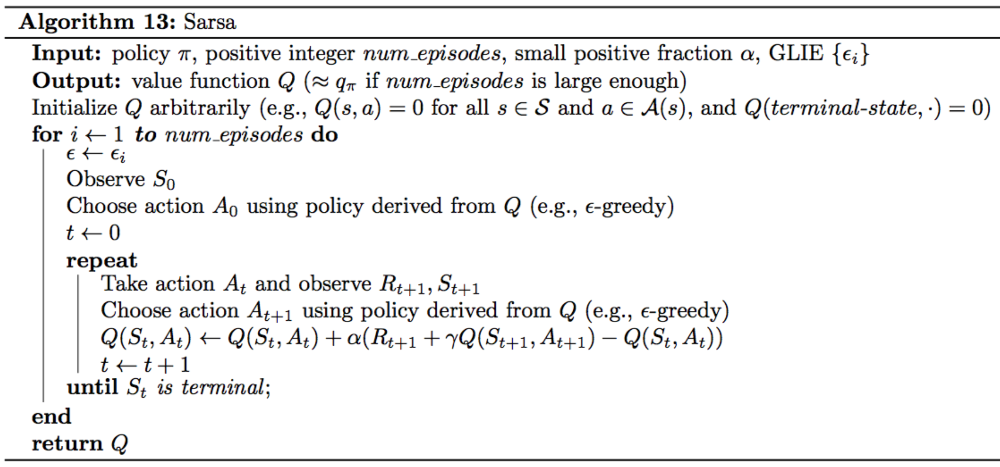
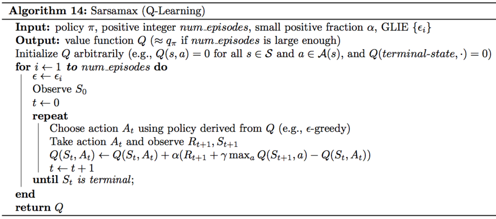
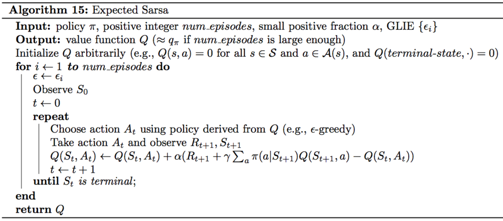
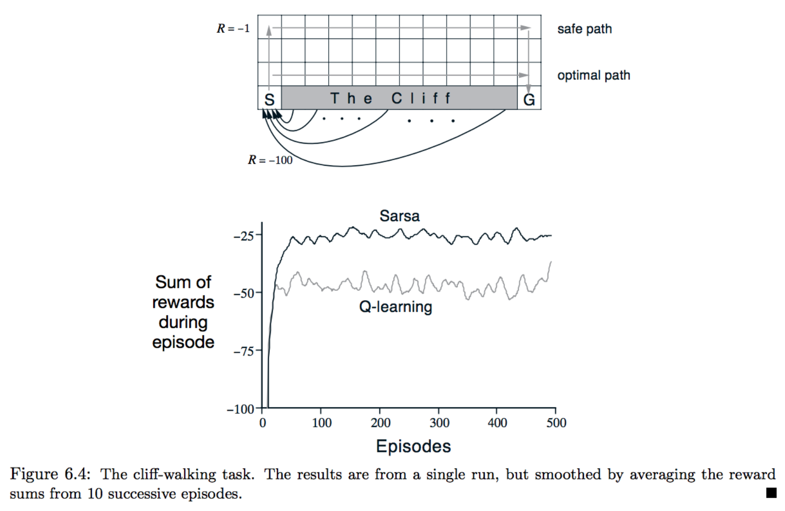

# Temporal-Difference Methods

### Instructions

In `Temporal_Difference.ipynb`, several TD methods(Sarsa, Q-learning, Expected Sarsa) are implemented based on the [CliffWalking](https://github.com/openai/gym/blob/master/gym/envs/toy_text/cliffwalking.py) environment in gym. In the CliffWalking environment, the agent navigates a 4x12 gridworld.

### Algorthms

- Sarsa

- Q-learning

- Expected-Sarsa

### Performance
Referencing the Udacity course:

- Sarsa and Expected_Sarsa are both **on-policy** TD control algorithms. In this case, In this case, the same ($\epsilon$-greedy) policy that is evaluated and improved is also used to select actions.

- Sarsamax is an **off-policy** method, where the (greedy) policy that is evaluated and improved is different from the ($\epsilon$-greedy) policy that is used to select actions.

- On-policy TD control methods (like Expected Sarsa and Sarsa) have better online performance than off-policy TD control methods (like Sarsamax).

- Expected Sarsa generally achieves better performance than Sarsa.

A performance comparison on Sutton's book:

The figure shows the performance of Sarsa and Q-learning on cliff walking environment for constant $\epsilon=0.1$.

- Q-learning achieves worse online performance (where the agent collects less reward on average in each episode), but learns the optimal policy.

- Sarsa achieves better online performance, but learns a sub-optimal "safe" policy.
